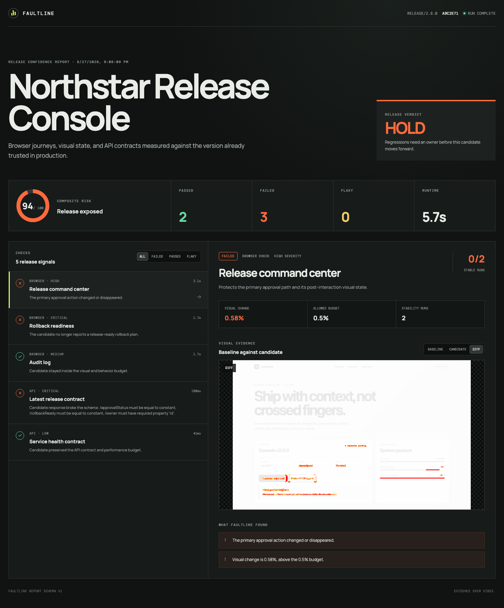
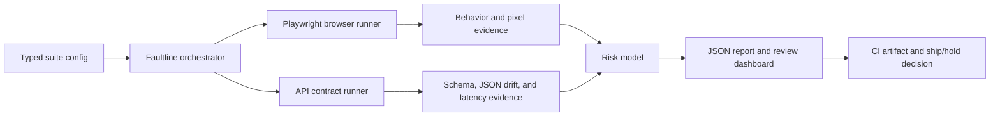

# Faultline

[](https://github.com/SirBrianIsBroke/faultline/actions/workflows/ci.yml)

Faultline is a release confidence tool for catching browser, visual, and API regressions before they become production problems.

I built it around a simple truth: a green unit test suite does not automatically mean a release is safe. Faultline compares the candidate environment against the version already trusted in production, repeats each check to expose unstable results, and leaves behind evidence that a human can actually review.



**Project started:** August 2026  
**Current status:** Working MVP

## What it does

- Runs the same browser journey against baseline and candidate environments.
- Checks visible behavior before comparing screenshots.
- Generates baseline, candidate, and pixel-diff artifacts.
- Validates API responses with JSON Schema.
- Reports structural payload drift and ignored volatile fields.
- Measures candidate latency against an explicit performance budget.
- Repeats checks and labels mixed outcomes as flaky.
- Converts severity and stability into a bounded release risk score.
- Produces a responsive report with a direct `SHIP` or `HOLD` verdict.

The included Northstar fixture is intentionally broken. It proves that Faultline can catch a changed approval action, a missing rollback path, an incompatible API response, and a latency regression while leaving stable checks green.

## Run the demo

Requirements:

- Node.js 22.12 or newer
- npm 10 or newer

```bash
npm install
npx playwright install chromium
npm run demo
npm run dev
```

Open `http://127.0.0.1:5173`. The demo should finish with a `HOLD` verdict because the candidate fixture contains deliberate regressions.

Run the complete verification pipeline with:

```bash
npm run verify
```

## Define a suite

Faultline uses a typed configuration file. Browser checks combine interaction, behavior, and visual budgets. API checks combine schema, response drift, and latency budgets.

```ts
import { defineConfig } from './src/config.js';

export default defineConfig({
  project: 'Release Console',
  baselineUrl: 'https://production.example.com',
  candidateUrl: 'https://candidate.example.com',
  stabilityRuns: 2,
  browser: [
    {
      id: 'checkout-approval',
      title: 'Checkout approval',
      description: 'Protects the primary approval journey.',
      path: '/checkout',
      severity: 'critical',
      assertions: [
        {
          type: 'text',
          selector: '[data-testid="approval-status"]',
          value: 'Approved',
          message: 'The approved state disappeared.',
        },
      ],
      maxDiffPercent: 0.25,
    },
  ],
  api: [
    {
      id: 'checkout-contract',
      title: 'Checkout contract',
      description: 'Protects the client payload.',
      path: '/api/checkout/latest',
      severity: 'critical',
      expectedStatus: 200,
      maxLatencyRegressionPercent: 25,
      ignorePaths: ['$.requestId'],
      schema: {
        type: 'object',
        required: ['id', 'status'],
        properties: {
          id: { type: 'string' },
          status: { const: 'approved' },
        },
      },
    },
  ],
});
```

Then run:

```bash
npx tsx src/cli.ts run
```

The CLI exits nonzero on `HOLD`, which makes it usable as a pull-request or deployment gate.

## Architecture



| Area | Responsibility |
| --- | --- |
| `src/browser-runner.ts` | Replays journeys, validates expected behavior, captures screenshots, and calculates pixel drift. |
| `src/api-runner.ts` | Executes paired requests, validates schemas, compares payloads, and checks latency budgets. |
| `src/json-diff.ts` | Produces deterministic field-level changes while excluding declared volatile paths. |
| `src/summary.ts` | Classifies stable/flaky outcomes and converts severity into a bounded risk score. |
| `dashboard/` | Presents release evidence in a responsive React report. |
| `scripts/fixture-server.ts` | Serves deterministic baseline and candidate environments for integration testing. |

Browser and API checks run concurrently, but checks inside each group remain sequential. That keeps local resource use predictable and leaves a clean path to bounded worker pools later.

## Failure model

Faultline treats these as different problems:

- **Baseline invalid:** the trusted environment no longer satisfies the declared behavior. The comparison cannot be trusted.
- **Stable regression:** every attempt fails in the same direction. This is a release blocker.
- **Flaky signal:** repeated attempts disagree. This still blocks the release because unstable evidence is not clean evidence.
- **Visual-only drift:** behavior passes, but the pixel difference exceeds its budget.
- **Contract drift:** candidate JSON no longer matches the baseline, even if it still satisfies a broad schema.
- **Performance regression:** the contract is correct, but candidate latency exceeds the allowed increase.

I kept the risk model explicit on purpose. A critical failure carries more weight than a cosmetic one, a flaky result carries half weight, and the final score cannot exceed 100. Teams can argue with the weights because they are visible instead of buried in a black box.

## Project decisions

- **Playwright instead of browser mocks:** the artifact needs to reflect a real rendered page and real interactions.
- **JSON Schema plus baseline diffing:** schema validation protects required behavior; diffing exposes compatible but suspicious changes.
- **Deterministic local fixtures:** anyone reviewing the repo can reproduce a useful pass/fail report without credentials or third-party services.
- **Static report contract:** the React UI only consumes versioned JSON, so it can later be hosted in CI, object storage, or an internal release service.
- **No automatic baseline acceptance:** changing trusted evidence is a human release decision, not a side effect of running a test.

## Commands

| Command | Purpose |
| --- | --- |
| `npm run demo` | Starts both fixtures, executes Faultline, and refreshes the report evidence. |
| `npm run dev` | Opens the report UI in development mode. |
| `npm test` | Runs focused unit coverage for configuration, JSON drift, stability, and risk. |
| `npm run typecheck` | Verifies the Node and React TypeScript projects. |
| `npm run lint` | Runs the repository lint rules. |
| `npm run build` | Produces the dashboard and CLI builds. |
| `npm run verify` | Runs the same complete quality gate used in CI. |

## Next engineering steps

- Parallel workers with per-origin concurrency limits.
- Chromium, Firefox, and WebKit project matrices.
- Auth state and secret-provider adapters for protected environments.
- Historical run storage and trend-based flake detection.
- GitHub check annotations attached directly to pull requests.
- Review and approval workflow for intentional visual changes.

## Security

Faultline points at real environments, so credentials and captured pages need care. Keep secrets outside configuration, use dedicated test accounts, avoid personal data in fixtures, and review artifacts before publishing them. See [SECURITY.md](SECURITY.md) for disclosure guidance.

## License

[MIT](LICENSE)
